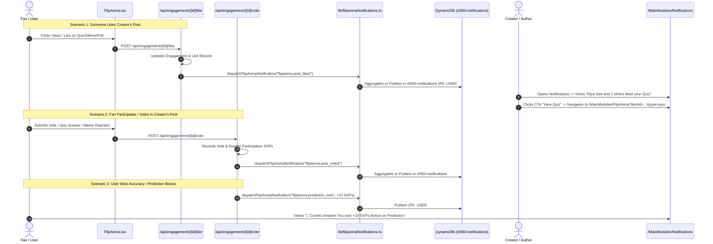

# FlipArena Architecture, Documentation & Notification Specification

## 1. Overview & Purpose
`FlipArena.tsx` is the primary gamification and interactive fan engagement hub for **SportsFan360**. It provides fans with real-time, interactive sports engagements spanning multiple disciplines (Cricket, Football, Basketball, Tennis, F1, etc.), rewarding users with **SXPs (SportsFan Experience Points)**.

### Core Gamification Rules
- **Participation Reward**: Every action (vote, answer submission, meme reaction, stake) awards **+2 SXPs**.
- **Correctness / Accuracy Bonus**: Choosing the correct answer in Quizzes, Polls, or Predictions awards **+10 SXPs** bonus (**+12 SXPs** total).
- **Single-Vote Policy**: Enforced through both client-side `localStorage` caching and backend DynamoDB persistence.

---

## 2. Engagement Modules Breakdown

| Engagement Type | Icon / Color Theme | Key Features | SXP Rewards |
| :--- | :--- | :--- | :--- |
| **Fan Battle** | ⚔️ Red/Orange (`#FF3D57` / `#FF7B02`) | Head-to-head competitor matchups, live percentage split, "Challenge a Friend" sharing | +2 SXPs for voting |
| **Quiz Arena** | 🧠 Purple (`#A855F7`) | Multi-question series, scheduled unlock timers (e.g. 10m intervals), answer explanations | +2 SXPs play, +10 SXPs correct |
| **Live Polls** | 📊 Blue (`#3B82F6`) | Multi-option community polls, scheduled start countdowns, expiration timers, winning choice resolution | +2 SXPs vote, +10 SXPs if winner |
| **Predictions** | 🎯 Emerald (`#10B981`) | Match outcome predictions, multiplier/odds display, stake locking | +2 SXPs stake, +10 SXPs win |
| **Meme Arena** | 🔥 Pink/Orange Gradient | Community meme drops, interactive emoji reactions (🔥, 😂, 💀, 🐐, 🤯), creator moderation | +2 SXPs reaction/drop |

---

## 3. Technology Stack & Integration (100% AWS DynamoDB)

Only technologies natively integrated into this project are utilized:

```
[ Frontend (Next.js 15 App Router / TypeScript) ]
    │
    ├─► UI Components & Motion: React, TailwindCSS, Framer Motion (AnimatePresence)
    ├─► State & Local Persistence: localStorage (`sf_quiz_*`, `sf_poll_*`, `sf_fb_*`), React hooks
    ├─► Event Bus: Browser `CustomEvent` (`sf360:new-notification`, `sf360:points-updated`, `arena-engagement-created`)
    ├─► Toast Notification: `NotificationToast.tsx` & in-component ephemeral toasts
    ├─► Notification Hub: `/MainModules/Notifications` (with Flip Arena & FlipLINE filters)
    │
    ▼
[ Next.js API Routes (`/api/engagements`, `/api/notifications`, `/api/engagements/[id]/like`, `/api/engagements/[id]/vote`) ]
    │
    ▼
[ AWS DynamoDB (Single-Table Schema: `sf360-notifications`, `SocialAndContent`) ]
    ├─► Helper: `@/lib/fliparenaNotifications.ts` (`dispatchFlipArenaNotification`)
    ├─► Helper: `@/lib/notifications.ts` (`createNotification`)
    ├─► Helper: `@/lib/dynamodb.ts` (`docClient`)
```

---

## 4. Pure DynamoDB Notification Schema (`sf360-notifications`)

All FlipArena notifications follow the single-table DynamoDB layout with 24-hour aggregation and sparse unread GSI indexing:

```json
{
  "PK": "USER#u_fan123",
  "SK": "NOTIF#2026-09-28T10:30:00.000Z#ntf_k9x2_a1b2c3",
  "entity_type": "NOTIFICATION",
  "notification_type": "fliparena.post_liked",
  "entity_id": "eng_1727500000_abc123",
  "actor_id": "u_fan456",
  "actor_name": "Riya Sen",
  "actor_avatar": "https://api.dicebear.com/7.x/bottts/svg?seed=riya",
  "actor_names": ["Riya Sen", "Arjun Sharma", "Karan Dave"],
  "aggregation_count": 3,
  "aggregation_key": "AGGR#fliparena.post_liked#eng_1727500000_abc123",
  "title": "FlipARENA",
  "body": "Riya Sen and 2 others liked your Quiz \"IPL Finals 2026\"",
  "cta_label": "View Quiz",
  "cta_target": "/MainModules/FlipArena?itemId=eng_1727500000_abc123&type=quiz",
  "priority": "NORMAL",
  "read": false,
  "sent_at": "2026-09-28T10:30:00.000Z",
  "expires_at": 1730104200,
  "GSI1PK": "TYPE#fliparena.post_liked",
  "GSI1SK": "SENTAT#2026-09-28T10:30:00.000Z#ntf_k9x2_a1b2c3",
  "GSI2PK": "USER#u_fan123#UNREAD",
  "GSI2SK": "SENTAT#2026-09-28T10:30:00.000Z#ntf_k9x2_a1b2c3"
}
```

---

## 5. End-to-End Notification Lifecycle (From Where to Where)



---

## 6. Notification Event Types in FlipArena

| Event Type (`notification_type`) | Trigger Condition | Aggregated Message Template | Deep Link Target (`cta_target`) |
| :--- | :--- | :--- | :--- |
| `fliparena.post_liked` | Fan likes a FlipArena card (Quiz, Poll, Pred, Meme, Battle) | **"{Actor} and {Count} others liked your {Type}"** | `/MainModules/FlipArena?itemId={id}&type={type}` |
| `fliparena.post_voted` | Fan participates/votes on author's engagement | **"{Actor} and {Count} others participated in your {Type}"** | `/MainModules/FlipArena?itemId={id}&type={type}` |
| `fliparena.meme_reaction` | Fan reacts with an emoji (🔥, 😂, 💀, 🐐, 🤯) to a meme | **"{Actor} and {Count} others reacted {Emoji} to your Meme"** | `/MainModules/FlipArena?itemId={id}&type=meme` |
| `fliparena.prediction_won` | User's prediction or quiz answer was correct | **"🎉 Correct Answer! You won +{Points} SXPs Bonus on {Type}"** | `/MainModules/FlipArena?itemId={id}&type={type}` |
| `fliparena.battle_challenged` | Friend challenges user to pick a side in Fan Battle | **"⚔️ {Actor} challenged you in a Fan Battle!"** | `/MainModules/FlipArena?itemId={id}&type=fan_battle` |
| `fliparena.milestone` | Engagement crosses engagement milestone (50+ reactions/votes) | **"🔥 Your {Type} is trending with high fan engagement!"** | `/MainModules/FlipArena?itemId={id}&type={type}` |

---

## 7. Deep Linking & URL Parameters
FlipArena automatically inspects query parameters and hash fragments to highlight and center cards:
- **`?itemId=<id>`** (or `?quizId=`, `?engagementId=`, `?cardId=`, `?id=`): Automatically fetches if not in local cache, brings card to top of list, applies glowing border, and smoothly scrolls to center.
- **`?type=<type>`**: Automatically activates corresponding tab (`quiz`, `poll`, `battle`, `prediction`, `meme`).

