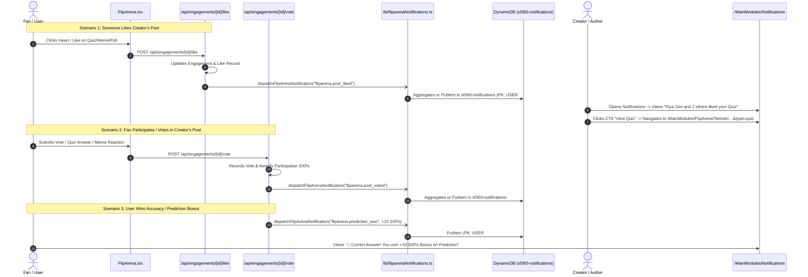
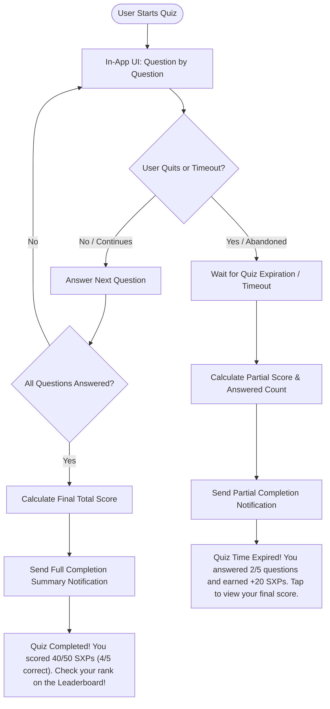
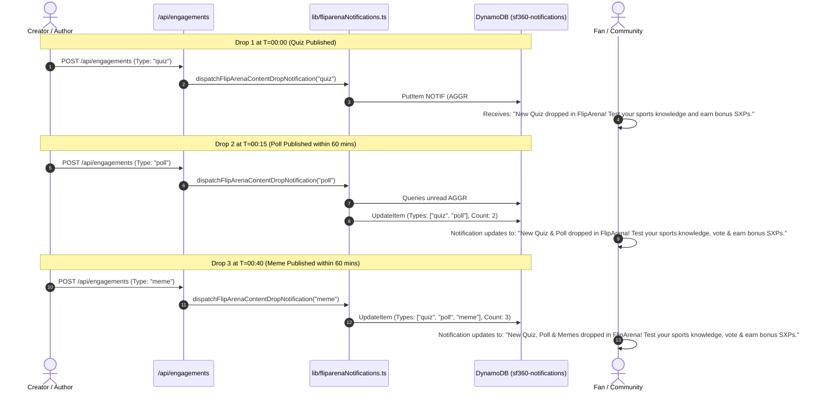

# FlipArena Architecture, Documentation & Notification Specification

## 1. Overview & Purpose
`FlipArena.tsx` is the primary gamification and interactive fan engagement hub for **SportsFan360**. It provides fans with real-time, interactive sports engagements spanning multiple disciplines (Cricket, Football, Basketball, Tennis, F1, etc.), rewarding users with **SXPs (SportsFan Experience Points)**.

### Core Gamification Rules
- **Participation Reward**: Every action (vote, answer submission, meme reaction, stake) awards **+2 SXPs**.
- **Correctness / Accuracy Bonus**: Choosing the correct answer in Quizzes, Polls, or Predictions awards **+10 SXPs** bonus (**+12 SXPs** total).
- **Single-Vote Policy**: Enforced through both client-side `localStorage` caching and backend DynamoDB persistence.

---

## 2. Engagement Modules Breakdown

| Engagement Type | Icon / Color Theme | Key Features | SXP Rewards |
| :--- | :--- | :--- | :--- |
| **Fan Battle** | ⚔️ Red/Orange (`#FF3D57` / `#FF7B02`) | Head-to-head competitor matchups, live percentage split, "Challenge a Friend" sharing | +2 SXPs for voting |
| **Quiz Arena** | 🧠 Purple (`#A855F7`) | Multi-question series, scheduled unlock timers (e.g. 10m intervals), answer explanations | +2 SXPs play, +10 SXPs correct |
| **Live Polls** | 📊 Blue (`#3B82F6`) | Multi-option community polls, scheduled start countdowns, expiration timers, winning choice resolution | +2 SXPs vote, +10 SXPs if winner |
| **Predictions** | 🎯 Emerald (`#10B981`) | Match outcome predictions, multiplier/odds display, stake locking | +2 SXPs stake, +10 SXPs win |
| **Meme Arena** | 🔥 Pink/Orange Gradient | Community meme drops, interactive emoji reactions (🔥, 😂, 💀, 🐐, 🤯), creator moderation | +2 SXPs reaction/drop |

---

## 3. Technology Stack & Integration (100% AWS DynamoDB)

Only technologies natively integrated into this project are utilized:

```
[ Frontend (Next.js 15 App Router / TypeScript) ]
    │
    ├─► UI Components & Motion: React, TailwindCSS, Framer Motion (AnimatePresence)
    ├─► State & Local Persistence: localStorage (`sf_quiz_*`, `sf_poll_*`, `sf_fb_*`), React hooks
    ├─► Event Bus: Browser `CustomEvent` (`sf360:new-notification`, `sf360:points-updated`, `arena-engagement-created`)
    ├─► Toast Notification: `NotificationToast.tsx` & in-component ephemeral toasts
    ├─► Notification Hub: `/MainModules/Notifications` (with Flip Arena & FlipLINE filters)
    │
    ▼
[ Next.js API Routes (`/api/engagements`, `/api/notifications`, `/api/engagements/[id]/like`, `/api/engagements/[id]/vote`) ]
    │
    ▼
[ AWS DynamoDB (Single-Table Schema: `sf360-notifications`, `SocialAndContent`) ]
    ├─► Helper: `@/lib/fliparenaNotifications.ts` (`dispatchFlipArenaNotification`)
    ├─► Helper: `@/lib/notifications.ts` (`createNotification`)
    ├─► Helper: `@/lib/dynamodb.ts` (`docClient`)
```

---

## 4. Pure DynamoDB Notification Schema (`sf360-notifications`)

All FlipArena notifications follow the single-table DynamoDB layout with 24-hour aggregation and sparse unread GSI indexing:

```json
{
  "PK": "USER#u_fan123",
  "SK": "NOTIF#2026-09-28T10:30:00.000Z#ntf_k9x2_a1b2c3",
  "entity_type": "NOTIFICATION",
  "notification_type": "fliparena.post_liked",
  "entity_id": "eng_1727500000_abc123",
  "actor_id": "u_fan456",
  "actor_name": "Riya Sen",
  "actor_avatar": "https://api.dicebear.com/7.x/bottts/svg?seed=riya",
  "actor_names": ["Riya Sen", "Arjun Sharma", "Karan Dave"],
  "aggregation_count": 3,
  "aggregation_key": "AGGR#fliparena.post_liked#eng_1727500000_abc123",
  "title": "FlipARENA",
  "body": "Riya Sen and 2 others liked your Quiz \"IPL Finals 2026\"",
  "cta_label": "View Quiz",
  "cta_target": "/MainModules/FlipArena?itemId=eng_1727500000_abc123&type=quiz",
  "priority": "NORMAL",
  "read": false,
  "sent_at": "2026-09-28T10:30:00.000Z",
  "expires_at": 1730104200,
  "GSI1PK": "TYPE#fliparena.post_liked",
  "GSI1SK": "SENTAT#2026-09-28T10:30:00.000Z#ntf_k9x2_a1b2c3",
  "GSI2PK": "USER#u_fan123#UNREAD",
  "GSI2SK": "SENTAT#2026-09-28T10:30:00.000Z#ntf_k9x2_a1b2c3"
}
```

---

## 5. End-to-End Notification Lifecycle (From Where to Where)



---

## 6. Notification Event Types in FlipArena

| Event Type (`notification_type`) | Trigger Condition | Aggregated Message Template | Deep Link Target (`cta_target`) |
| :--- | :--- | :--- | :--- |
| `fliparena.post_liked` | Fan likes a FlipArena card (Quiz, Poll, Pred, Meme, Battle) | **"{Actor} and {Count} others liked your {Type}"** | `/MainModules/FlipArena?itemId={id}&type={type}` |
| `fliparena.post_voted` | Fan participates/votes on author's engagement | **"{Actor} and {Count} others participated in your {Type}"** | `/MainModules/FlipArena?itemId={id}&type={type}` |
| `fliparena.meme_reaction` | Fan reacts with an emoji (🔥, 😂, 💀, 🐐, 🤯) to a meme | **"{Actor} and {Count} others reacted {Emoji} to your Meme"** | `/MainModules/FlipArena?itemId={id}&type=meme` |
| `fliparena.prediction_won` | User's prediction or quiz answer was correct | **"🎉 Correct Answer! You won +{Points} SXPs Bonus on {Type}"** | `/MainModules/FlipArena?itemId={id}&type={type}` |
| `fliparena.battle_challenged` | Friend challenges user to pick a side in Fan Battle | **"⚔️ {Actor} challenged you in a Fan Battle!"** | `/MainModules/FlipArena?itemId={id}&type=fan_battle` |
| `fliparena.milestone` | Engagement crosses engagement milestone (50+ reactions/votes) | **"🔥 Your {Type} is trending with high fan engagement!"** | `/MainModules/FlipArena?itemId={id}&type={type}` |
| `fliparena.quiz_completed` | User completes all questions in a multi-quiz series | **"Quiz Completed! You scored {earned}/{total} SXPs ({correct}/{totalQ} correct). Check your rank on the Leaderboard!"** | `/MainModules/FlipArena?itemId={id}&type=quiz&tab=leaderboard` |
| `fliparena.quiz_expired_partial` | Quiz timer expires or session is abandoned with partial answers | **"Quiz Time Expired! You answered {answered}/{totalQ} questions and earned +{earned} SXPs. Tap to view your final score."** | `/MainModules/FlipArena?itemId={id}&type=quiz` |

---

## 7. Deep Linking & URL Parameters
FlipArena automatically inspects query parameters and hash fragments to highlight and center cards:
- **`?itemId=<id>`** (or `?quizId=`, `?engagementId=`, `?cardId=`, `?id=`): Automatically fetches if not in local cache, brings card to top of list, applies glowing border, and smoothly scrolls to center.
- **`?type=<type>`**: Automatically activates corresponding tab (`quiz`, `poll`, `battle`, `prediction`, `meme`).

---

## 8. Multi-Quiz Lifecycle & Notification Flow

To prevent notification fatigue and ensure high engagement quality, multi-question quizzes follow a **Single Summary Notification Policy**:
- **During Quiz (In-App)**: Instant visual feedback and local score calculation per question (No push notifications dispatched per question).
- **On Full Completion**: Exactly **1 Summary Push Notification** with total score and leaderboard rank CTA.
- **On Abandonment / Expiry (Partial)**: If the user drops off or the timer expires before finishing all questions, a **Partial Score Notification** is sent after timeout.

### 8.1 Flowchart & Decision Logic

```
User Starts Quiz
                         │
        ┌────────────────┴────────────────┐
   [In-App UI]                    [Abandon / Quit?]
  Instant feedback                      │
  per question (No Push)                ├── YES ──> Wait for Timeout
        │                               │           Calculate Partial Score
  Finishes Quiz?                        │           Send "Partial Score / Abandoned" Push
        │                               │
       YES                              └── NO ───> Continue answering
        │
Calculate Final Total
Send 1 Summary Push Notification
```

#### Mermaid Workflow:



---

### 8.2 Multi-Quiz Notification Templates

| Completion State | Trigger Condition | Notification Message Template | Target CTA (`cta_target`) |
| :--- | :--- | :--- | :--- |
| **Full Completion** | User finishes all questions in the multi-quiz series | `"Quiz Completed! You scored {earned}/{total} SXPs ({correct}/{totalQ} correct). Check your rank on the Leaderboard!"` | `/MainModules/FlipArena?itemId={quizId}&type=quiz&tab=leaderboard` |
| **Partial Completion** | User abandons or session timer expires with unanswered questions | `"Quiz Time Expired! You answered {answered}/{totalQ} questions and earned +{earned} SXPs. Tap to view your final score."` | `/MainModules/FlipArena?itemId={quizId}&type=quiz` |

---

### 8.3 Multi-Quiz DynamoDB Notification Payload Examples

#### Full Completion Payload (`fliparena.quiz_completed`):
```json
{
  "PK": "USER#u_fan123",
  "SK": "NOTIF#2026-09-30T10:45:00.000Z#ntf_qz_full_123",
  "entity_type": "NOTIFICATION",
  "notification_type": "fliparena.quiz_completed",
  "entity_id": "eng_1727500000_quiz99",
  "title": "FlipARENA",
  "body": "Quiz Completed! You scored 40/50 SXPs (4/5 correct). Check your rank on the Leaderboard!",
  "cta_label": "View Leaderboard",
  "cta_target": "/MainModules/FlipArena?itemId=eng_1727500000_quiz99&type=quiz&tab=leaderboard",
  "priority": "HIGH",
  "read": false,
  "data": {
    "quizId": "eng_1727500000_quiz99",
    "scoreEarned": 40,
    "scorePossible": 50,
    "correctCount": 4,
    "totalQuestions": 5
  },
  "sent_at": "2026-09-30T10:45:00.000Z",
  "expires_at": 1730104200,
  "GSI1PK": "TYPE#fliparena.quiz_completed",
  "GSI1SK": "SENTAT#2026-09-30T10:45:00.000Z#ntf_qz_full_123",
  "GSI2PK": "USER#u_fan123#UNREAD",
  "GSI2SK": "SENTAT#2026-09-30T10:45:00.000Z#ntf_qz_full_123"
}
```

#### Partial Completion Payload (`fliparena.quiz_expired_partial`):
```json
{
  "PK": "USER#u_fan123",
  "SK": "NOTIF#2026-09-30T11:00:00.000Z#ntf_qz_part_456",
  "entity_type": "NOTIFICATION",
  "notification_type": "fliparena.quiz_expired_partial",
  "entity_id": "eng_1727500000_quiz99",
  "title": "FlipARENA",
  "body": "Quiz Time Expired! You answered 2/5 questions and earned +20 SXPs. Tap to view your final score.",
  "cta_label": "View Score",
  "cta_target": "/MainModules/FlipArena?itemId=eng_1727500000_quiz99&type=quiz",
  "priority": "NORMAL",
  "read": false,
  "data": {
    "quizId": "eng_1727500000_quiz99",
    "scoreEarned": 20,
    "answeredCount": 2,
    "totalQuestions": 5
  },
  "sent_at": "2026-09-30T11:00:00.000Z",
  "expires_at": 1730104200,
  "GSI1PK": "TYPE#fliparena.quiz_expired_partial",
  "GSI1SK": "SENTAT#2026-09-30T11:00:00.000Z#ntf_qz_part_456",
  "GSI2PK": "USER#u_fan123#UNREAD",
  "GSI2SK": "SENTAT#2026-09-30T11:00:00.000Z#ntf_qz_part_456"
```

---

## 9. 60-Minute Aggregated New Content Drop Notifications

To eliminate spam and ensure high engagement click-through rates when authors publish new content into FlipArena, a **60-Minute Aggregation Window** is enforced across the platform.

### 9.1 Anti-Spam & Aggregation Philosophy
- **Anti-Spam Guarantee**: Instead of broadcasting 3 separate push notifications if 1 quiz, 1 poll, and 1 meme drop within an hour, the system automatically collapses them into **1 consolidated notification payload**.
- **Window Duration**: **60 minutes (1 Hour)** via `AGGR#fliparena.content_dropped`.
- **Dynamic Content Message**: Dynamically lists the distinct types of content dropped in that 60-minute window so fans know exactly what actions and rewards await them.

### 9.2 Consolidated Copy Generation Matrix

| Dropped Content in 60-min Window | Consolidated Notification Title | Consolidated Notification Body Copy | CTA Button & Target |
| :--- | :--- | :--- | :--- |
| **Quiz Only** | `FlipARENA` | `"New Quiz dropped in FlipArena! Test your sports knowledge and earn bonus SXPs."` | `Play & Earn` ➔ `/MainModules/FlipArena` |
| **Poll Only** | `FlipARENA` | `"New Poll dropped in FlipArena! Vote now and earn bonus SXPs."` | `Play & Earn` ➔ `/MainModules/FlipArena` |
| **Meme Only** | `FlipARENA` | `"New Memes dropped in FlipArena! React to the latest drops and earn bonus SXPs."` | `Play & Earn` ➔ `/MainModules/FlipArena` |
| **Fan Battle Only** | `FlipARENA` | `"New Fan Battle dropped in FlipArena! Pick your side and earn bonus SXPs."` | `Play & Earn` ➔ `/MainModules/FlipArena` |
| **Prediction Only** | `FlipARENA` | `"New Match Prediction dropped in FlipArena! Predict outcomes and win bonus SXPs."` | `Play & Earn` ➔ `/MainModules/FlipArena` |
| **Quiz + Poll** | `FlipARENA` | `"New Quiz & Poll dropped in FlipArena! Test your sports knowledge, vote & earn bonus SXPs."` | `Play & Earn` ➔ `/MainModules/FlipArena` |
| **Quiz + Meme** | `FlipARENA` | `"New Quiz & Memes dropped in FlipArena! Test your knowledge, react & earn bonus SXPs."` | `Play & Earn` ➔ `/MainModules/FlipArena` |
| **Poll + Meme** | `FlipARENA` | `"New Poll & Memes dropped in FlipArena! Vote, react & earn bonus SXPs."` | `Play & Earn` ➔ `/MainModules/FlipArena` |
| **Quiz + Poll + Meme** | `FlipARENA` | `"New Quiz, Poll & Memes dropped in FlipArena! Test your sports knowledge, vote & earn bonus SXPs."` | `Play & Earn` ➔ `/MainModules/FlipArena` |
| **Quiz, Poll, Fan Battle & Meme** | `FlipARENA` | `"New Quiz, Poll, Fan Battle & Memes dropped in FlipArena! Tap to participate and earn bonus SXPs."` | `Play & Earn` ➔ `/MainModules/FlipArena` |

---

### 9.3 60-Minute Aggregation Workflow

```
   Author Publishes New Quiz / Poll / Meme
                      │
                      ▼
       [ POST /api/engagements ]
                      │
     Check Existing Unread Drop Notif
     with AGGR#fliparena.content_dropped
     within last 60 Minutes?
             ┌────────┴────────┐
            YES                NO
             │                 │
    Merge Dropped Type       Create Fresh Drop Notif
    & Re-calculate Copy      with Initial Type Copy
             │                 │
    Update DynamoDB Item     PutItem into DynamoDB
    (Single Consolidate)     (Starts 60-min window)
             │                 │
             └────────┬────────┘
                      ▼
       1 Consolidated Notification in Fan's Feed:
  "New Quiz, Poll & Memes dropped in FlipArena!
   Test your sports knowledge, vote & earn bonus SXPs."
                      │
                      ▼
   Fan taps CTA "Play & Earn" ➔ Opens /MainModules/FlipArena
```

#### Mermaid Sequence Diagram:


---

### 9.4 Consolidated Content Drop DynamoDB Notification Payload

```json
{
  "PK": "USER#u_fan123",
  "SK": "NOTIF#2026-09-30T10:40:00.000Z#ntf_drop_789abc",
  "entity_type": "NOTIFICATION",
  "notification_type": "fliparena.content_dropped",
  "entity_id": "eng_1727500000_quiz99",
  "actor_id": "SYSTEM",
  "actor_name": "FlipARENA",
  "actor_avatar": "https://api.dicebear.com/7.x/bottts/svg?seed=fliparena",
  "aggregation_key": "AGGR#fliparena.content_dropped",
  "aggregation_count": 3,
  "dropped_types": ["quiz", "poll", "meme"],
  "dropped_count": 3,
  "title": "FlipARENA",
  "body": "New Quiz, Poll & Memes dropped in FlipArena! Test your sports knowledge, vote & earn bonus SXPs.",
  "message": "New Quiz, Poll & Memes dropped in FlipArena! Test your sports knowledge, vote & earn bonus SXPs.",
  "cta_label": "Play & Earn",
  "cta_target": "/MainModules/FlipArena",
  "priority": "NORMAL",
  "read": false,
  "isRead": false,
  "sent_at": "2026-09-30T10:40:00.000Z",
  "expires_at": 1730104200,
  "category": "fliparena",
  "feature_area": "fliparena",
  "GSI1PK": "TYPE#fliparena.content_dropped",
  "GSI1SK": "SENTAT#2026-09-30T10:40:00.000Z#ntf_drop_789abc",
  "GSI2PK": "USER#u_fan123#UNREAD",
  "GSI2SK": "SENTAT#2026-09-30T10:40:00.000Z#ntf_drop_789abc"
}
```


